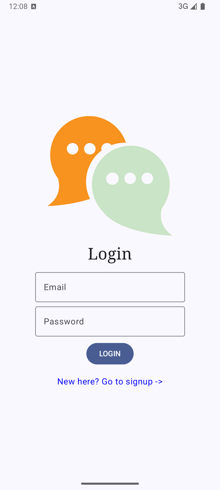
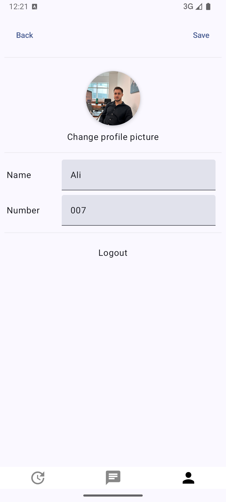

# ChatAppFirebase

A modern chat application developed using Firebase and Jetpack Compose, offering real-time messaging and a seamless user experience.

## Features
- **Login and Registration**: Secure user authentication and account creation with Firebase Authentication.
- **Real-Time Chat**: Instant messaging capabilities powered by Firebase Realtime Database.
- **Profile Management**: View and edit user profiles.
- **Chat List**: Display and navigate through existing chats and messages.

## Technologies Used
- **Firebase**: Provides authentication, database, and real-time data synchronization.
- **Jetpack Compose**: Modern UI toolkit for building native Android UIs with a declarative approach.
- **Hilt**: Dependency Injection framework for managing dependencies and reducing boilerplate code.
- **MVVM (Model-View-ViewModel)**: Ensures clean and maintainable architecture.
- **Kotlin Coroutines & Flow**: For managing asynchronous operations and data streams.

## Project Structure
- **data**: Manages data models, repositories, and constants.
- **ui**: Contains UI components and screens built with Jetpack Compose.
- **HiltModule.kt**: Manages dependency injection configuration using Hilt.

## Application Screenshots

| Login Screen | Profile Screen | Chat Screen | Contacts Screen |
| --- | --- | --- | --- |
|  |  |  |  |

## Installation and Setup

1. Clone the repository:
   ```bash
   git clone https://github.com/alidumanyp/ChatAppFirebase.git
